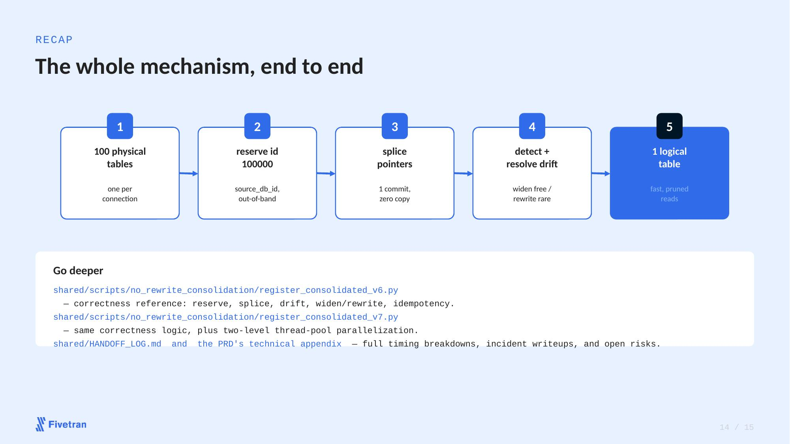
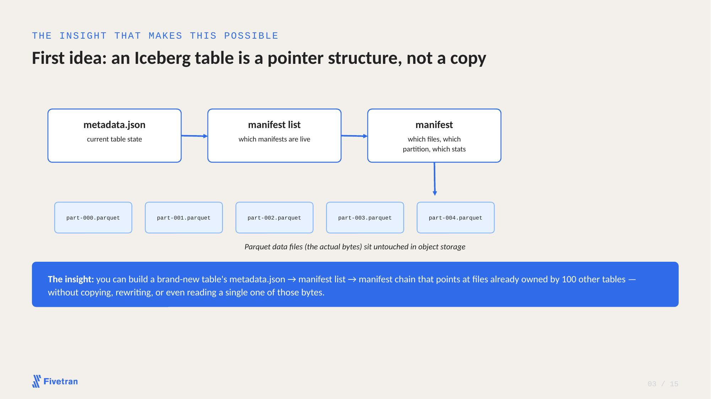

# Reference architecture

The two diagrams below are pulled directly from the slide deck this repo's
technique was pitched and explained from — not redrawn from scratch, so they
stay consistent with whatever's actually being presented.

**Full deck:** [No-Rewrite Table Consolidation — exec deck + mechanism deep dive](https://docs.google.com/presentation/d/1zie3Rp3qcVEms50A7C_RiJgRVx-RGG2Z4xZ9JqbWg8U/edit)
(the step-by-step "how it works" walkthrough was merged into this deck; that's
the one to look at or hand to someone else).

## The whole mechanism, end to end

Five stages, each corresponding directly to a piece of
`scripts/register_consolidation.py` (adapted here from the original
`register_consolidated_v6.py`/`v7.py` reference implementation — see
`HOW_IT_WORKS.md` for the full walkthrough of each stage):

1. **100 physical tables** — one per source connection, each a fully
   independent Iceberg table before this tool touches anything.
2. **Reserve id** — the consolidated table's own bookkeeping column
   (`source_id_column` in `config.yaml`) gets a permanently reserved,
   out-of-band field id, never "next available."
3. **Splice pointers** — every source's existing Parquet files get a
   reference injected into the target table's manifest, tagged by source.
   Zero bytes copied or rewritten.
4. **Detect + resolve drift** — new columns widen the schema for free in the
   common case; a genuine cross-source field-id collision falls back to a
   real, but delta-scoped, rewrite.
5. **1 logical table** — fast, correctly-pruned reads, even though the
   manifest technically references every source's files.

## Why this is possible at all

The whole technique rests on one fact: an Iceberg table's identity is its
metadata chain (`metadata.json` -> manifest list -> manifest), not the
Parquet files themselves. Building a new table that points at existing
files someone else already owns is a metadata operation — cheap, fast, and
requires touching zero of the underlying bytes.

For the full mechanism — including the schema-drift collision case, the
idempotency guarantees, and what this does *not* yet handle — see
[`HOW_IT_WORKS.md`](HOW_IT_WORKS.md) and the safety notes in the top-level
[`README.md`](../README.md).
